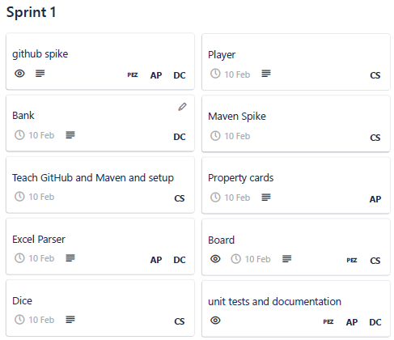
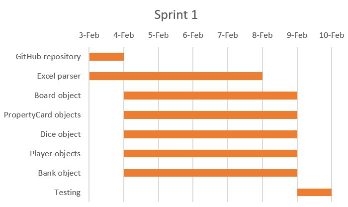
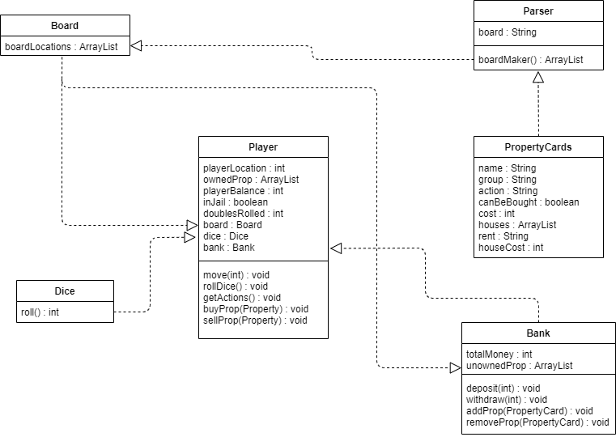
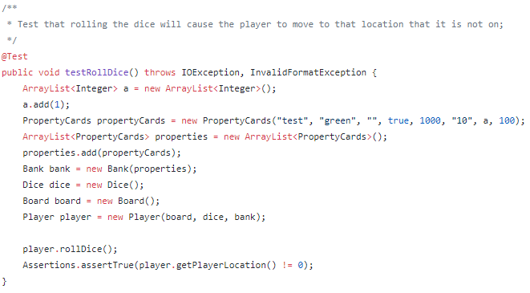
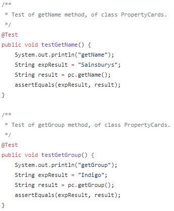
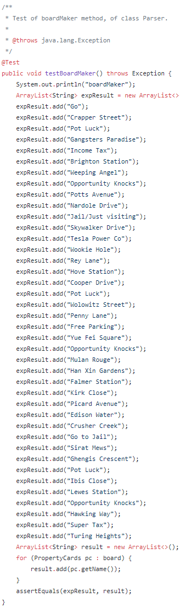
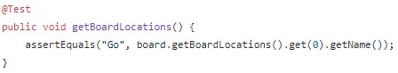
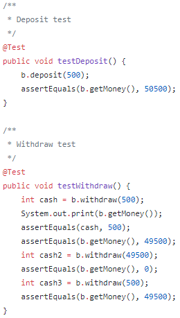
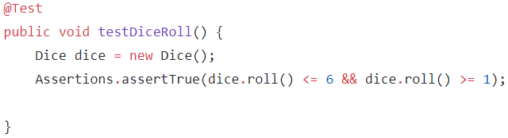

# Sprint 1 Documentation

## Summary Data

- **Team Number:** 13
- **Team Lead:** Chris
- **Sprint Start:** 03/02/2020
- **Sprint End:** 10/02/2020

## Individual Key Contributions

| Team Member | Key Contributions |
| :---------: | :---------------: |
|    Aiden    |   Documentation & Implementation   |
|   Ankeet    |  Implementation   |
|    Chris    |   Organisation & Implementation   |
|   Duarte    |  Implementation   |

## Task Cards

- Establish GitHub repository
- Create property cards
- Develop Excel parser to input information about property cards
- Create individual players
- Create board with property cards from parser
- Create dice that a player can roll
- Create bank that will hold money and properties

The image below shows the tasks set out on Trello during our weekly meeting

## Gantt Chart

## Requirements Analysis

### Functional Requirements

- F1
    - The software should be able to automatically parse an Excel file to create the board tiles. The each board tile shall include the name, the associated group, any actions to be performed, the price of the property, the rent with and without houses and each individual house cost. An additional parameter should be added to indicate if the board tile is an ownable property by a player. The parser shall return a list of board tiles in the order in the Excel document.
- F2
    - The software shall have players that play the game. The amount of players in a single game shall be between 2 - 6 players. Each player should have a name, a balance, a list of ownable properties, their location on the board, whether the player is in jail and the amount of doubles rolled during a turn. A player shall start with £1,500 in their balance. A player shall be able to roll dice to update their location on the board. The sum of all rolls is summed together and player moves that amount of spaces forward. If the player rolls the dice and both dice have the same number, the player shall roll again. If this continues after rolling 3 consecutive doubles, the player is moved to jail. The player should be able to see what actions they can perform at each instant during their turn. The player shall buy a property when they land on that property. The player shall also sell properties from any location during their turn. When a player is buying a property, their balance shall be deducted by the price of the property and the property shall be added to their list of owned properties. The selling of a property shall deposit the price of the property into the player's balance and the property is removed from their list of owned properties.
- F3
    - The software shall construct a board built upon the board tiles created by the parser. The board will hold all the board tiles associated in the game.
- F4
    - The software shall have dice that should be rolled. Each die is 6-sided; therefore, a number between 1 - 6 shall be returned when rolled.
- F5
    - The software shall have a bank that initially owns all of the properties that can be owned and a sum of money. At the start of the game, the bank shall start with £50,000 in its balance and all ownable properties. If the bank cannot withdraw enough funds to give to a player, the bank shall automatically replenish its funds by adding an additional £50,000. The bank shall add and remove properites from its list of ownable properties.

### Non-Functional Requirements
- NF1
    - The language the software shall be written in Java.
- NF2
    - Maven shall be used to manage the project including but not limited to managing dependencies and building the parser.
- NF3
    - The implementation of the project will vary between the IDEs of NetBeans and Intellij.

### Domain Requirements
- D1
    - The version control of the project should be stored on GitHub, iteration by iteration. Need more information on how to edit and update repository.

## Design

### UML Diagram
___

### Sequence Diagrams
___

#### Creating the board

#### Buying a property

## Test Plan

With this sprint being the first, we chose to not have system-wide testing
due to the face that there was no 'main' class that would control these objects.
Apart from that, all objects had a JUnit test with multiple test methods to ensure
the object was behaving propertly, correctly and error-free. This will apply to every sprint until a function GUI
is implemented.

With the **Player** test class, we have created tests that determine whether:
1. rolling the dice advances the player
2. ensures moving completely around the board does not result in an `IndexOutOfBoundsException`
3. buying a property results in the specific property being added to the player's owned properties

With the **PropertyCard** test class, the tests that are implemented show that:
1. ensure the accessors return the correct values

With the **Parser** test class, the sole responsibility of this test class to ensure:
1. the correct number of PropertyCards were being created
2. the list of PropertyCards were in the correct order

With the **Board** test class, the only test method needed was that the Parser
passed on the PropertyCards to the Board object.

With the **Bank** test class, our team ensured that:
1. the initial balance of the bank is £50,000
2. depositing a certain amount of money resulted in adding said money to the bank's balance
3. withdrawing a certain amount of moeny resulted in subtracting said money from the bank's balance
4. if the bank senses that a transaction will make its balance becomes negative, the bank replenishes itself to £50,000
5. a property can be removed the bank's list of properties
6. a property can be added back to the bank's list of properties

With the **Dice** test class, the sole method ensured that the amount shown on the dice was between 1 and 6.

## Summary of Sprint

