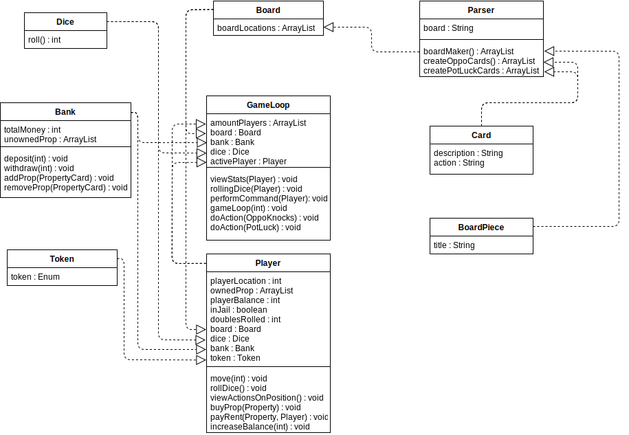

# Sprint 3 Documentation

## Summary Data

- **Team Number:** 13
- **Team Lead:** Chris
- **Sprint Start:** 17/02/2020
- **Sprint End:** 24/02/2020

## Individual Key Contributions

| Team Member | Key Contributions |
| :---------: | :---------------: |
|    Aiden    |  Documentation & Implementation   |
|   Ankeet    |  Implementation   |
|    Chris    |  Organisation & Implementation   |
|   Duarte    |  Implementation   |

## Task Cards

- Develop a parser to create Opportunity Knocks and Pot Luck cards
- Create methods to perform Opportunity Knocks and Pot Luck actions
- Revise tokens to include images of said tokens
- Revise property card structure
- Update dice to return both values instead of calling dice twice
- Develop methods to be assigned to buttons

The image below shows the tasks set out on Trello during our weekly meeting

## Gantt Chart

## Requirements Analysis

### Functional Requirements

- F1
  - The software should have an automatic parser that scans an Excel file named `PropertyTycoonCardData` and create all Opportunity Knocks and Pot Luck cards. This file contains all the information to create each Opportunity Knocks and Pot Luck card as well as grouping each card together into a list.
- F2
  - The software shall have methods to properly perform the actions of any Opportunity Knocks or Pot Luck card if landed upon by a player.
- F3
  - The software shall have hand-made images of the proposed list of tokens including a boot, a cat, a goblet, a hatstand, a phone and a spoon. These images will be created as Portable Network Graphics (PNG) files or Scalable Vector Graphics (SVG) files.
- F4
  - Rolling the dice should return 2 values for the 2 dice rolled.
- F5
  - The software shall have buttons that shall have the appropriate actions performed when pressed.

### Non-Functional Requirements
- NF1
  - The OO design of the `Card` class shall have 2 subclasses, `OpportunityKnocks` and `PotLuck`.
- NF2
  - The OO design of `BoardPiece` shall be the superclass of a variety of classes of which represent different properties with different behaviours. A diagram of the design of the new property cards are shown in the UML section.

### Domain Requirements
- D1
  - The team is unsure of how the mortgaging system will work. A question will be posed to the client in the next meeting.
- D2
  - It is unclear what happens after rolling a double. Does the player have the ability to move, possibly buy the property and roll again? The team hopes this question will be answered at a later meeting.

## Design

### UML Diagram
___

The image below shows the design of how the OpportunityKnocks and PotLuck cards were created

The image below shows the design of how the BoardPieces are structured

### Sequence Diagrams
___

#### Player picks up OpportunityKnocks/PotLuck and must put £15 in FreeParking

#### Player picks up OpportunityKnocks/PotLuck, advances to Go and received £200 

## Test Plan

With respect to the Graphical User Interface, the tests created in the last sprint were used as verification.

To ensure the correct objects were being created in regards to the Opportunity Knocks and the Pot Luck cards, the 2 images below highlight the validations done in the Parser test class.

## Summary of Sprint