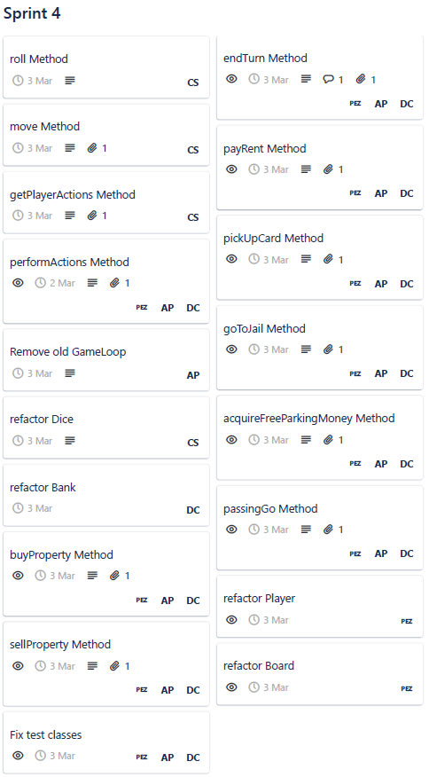
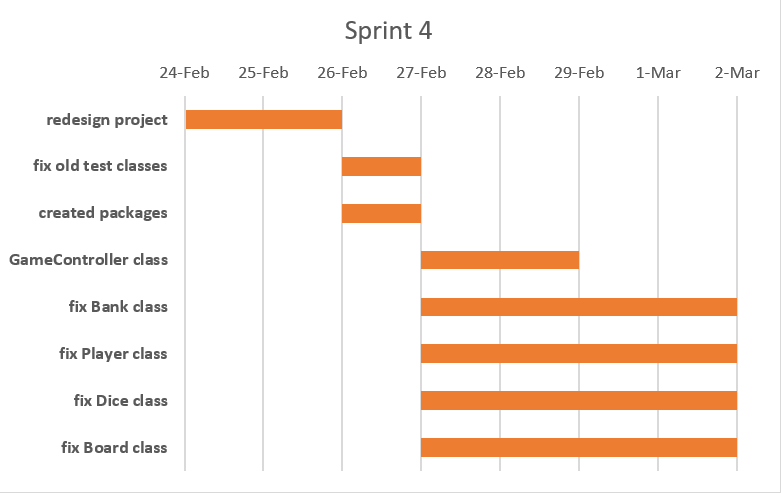

# Sprint 4 Documentation

## Summary Data

- **Team Number:** 13
- **Team Lead:** Ankeet
- **Sprint Start:** 24/02/2020
- **Sprint End:** 02/03/2020

## Individual Key Contributions

| Team Member | Key Contributions |
| :---------: | :---------------: |
|    Aiden    |  Documentation & Implementation   |
|   Ankeet    |  Organisation & Implementation   |
|    Chris    |  Implementation   |
|   Duarte    |  Implementation   |

## Task Cards

- Redesign and rethink the entire project
- Refactor previous classes

The image below shows the tasks set out on Trello during our weekly meeting

## Gantt Chart

## Requirements Analysis

### Functional Requirements

- F1
  - 

### Non-Functional Requirements
- NF1
  - 

### Domain Requirements
- D1
  - 

## Design

### UML Diagram
___

### Sequence Diagrams
___

#### Sequence 1

#### Sequence 2

## Test Plan

## Summary of Sprint