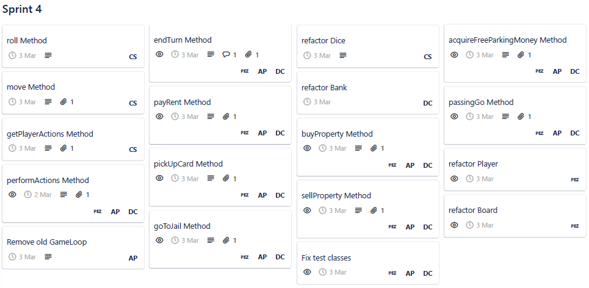
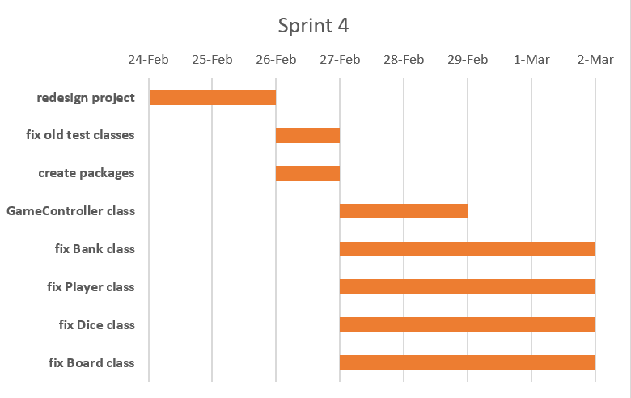

# Sprint 4 Documentation

## Summary Data

- **Team Number:** 13
- **Team Lead:** Ankeet
- **Sprint Start:** 24/02/2020
- **Sprint End:** 02/03/2020

## Individual Key Contributions

| Team Member | Key Contributions |
| :---------: | :---------------: |
|    Aiden    |  Documentation & Implementation   |
|   Ankeet    |  Organisation & Implementation   |
|    Chris    |  Implementation   |
|   Duarte    |  Implementation   |

## Task Cards

- Redesign and rethink the entire project
- Refactor previous classes

The image below shows the tasks set out on Trello during our weekly meeting

Below are some images taken from one of the brain-storming days

## Gantt Chart

## Requirements Analysis

### Non-Functional Requirements
- NF1
  - The need for a redesign this sprint was due to the fact that our mindset was based off the textual-based game instead of developing methods to be deployed in the GUI. So after some time, we came up with a new design that should be easier to function with less spagetification (fewer calls to other classes).

## Design

### UML Diagram
___

### Sequence Diagrams
___

#### the getPlayerActions method when a player can buy a property

#### the goToJail method when a player lands on GoToJail piece or triple double roll

## Test Plan

With the redesign, all of the logic happens in the `GameController` class. With this, a majority of the tests reside to test the functionality of the methods that could be implemented in the GUI.

In the image below, a test method of `getAction` shows the different scenarios the team is testing the class against. The result indicated what actions need to be performed by the GameController and by the player themselves.

In the image below, a test method of `doActions` ensures the automatic methods are run in the GameConroller. The resulting ArrayList indicates the list of possibilities the player can take. This list also determines what buttons on the GUI can be clicked upon and enabled.

## Summary of Sprint