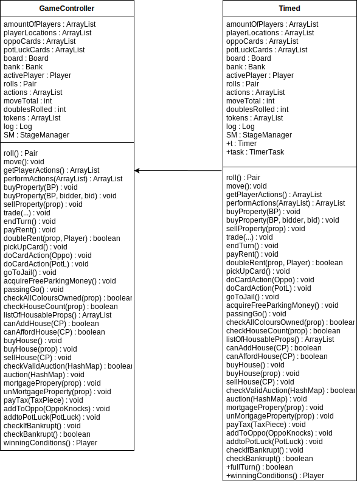

# Sprint 10 Documentation

## Summary Data

- **Team Number:** 13
- **Team Lead:** Ankeet
- **Sprint Start:** 08/05/2020
- **Sprint End:** 15/05/2020

## Individual Key Contributions

| Team Member | Key Contributions |
| :---------: | :---------------: |
|    Aiden    |  Documentation    |
|   Ankeet    |  Implementation   |
|    Chris    |  Implementation   |
|   Duarte    |  Implementation   |

## Task Cards

- Complete documentation
- Finish timed version of normal game
- Record video of game
- Create an executable JAR file
- Make public the GitHub repo
- Add winning conditions for both versions of the game
- Make PropertyTycoon logo
- Create company logo

The image below shows the tasks set out on Trello during our weekly meeting

## Gantt Chart

## Requirements Analysis

### Functional Requirements

- F1
  - The software shall have a timed version of the game. There shall exist a timer to count down from a set amount of time. 
- F2
  - The software shall end a game considering what type of game is being played.
- F3
  - A logo should be developed to associate the game of Property Tycoon.

### Non-Functional Requirements

- NF1
  - For the timed game, a timer is preset for a determined amount of time. When the timer stops, the software shall wait for every player to have equal turns in the game. Once this has been detected, the player with the largest amount of assets wins the game. To calculate a player's assets, the software shall sum the balance, the price of owned properties and the price of all houses on all owned properties.
- NF2
  - The winning conditions for the normal game of Property Tycoon shall be when there is a single player exist in the game. With this, all other players have become bankrupt.

## Design

### UML Diagram
___

#### GameController class structure

#### Player class structure

#### Card class structure

#### BoardPiece class structure

## Test Plan

All the testing done in this sprint is system-wide testing to ensure the AI players can operate properly and perform actions just like any other real life player. System-wide testing was also being used to test the timed version of the game.

## Summary of Sprint

This sprint was the final sprint of the project. The sprint was mainly the preparation of the documentation and the final release of the game. 