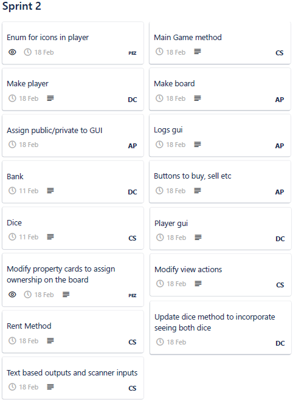
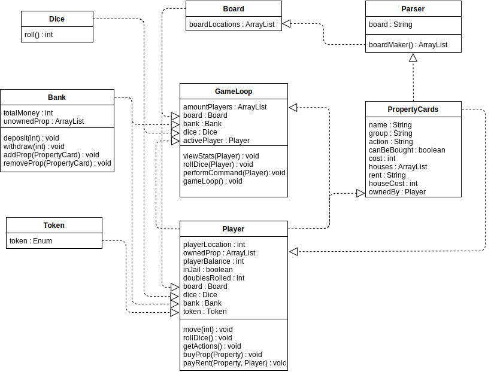
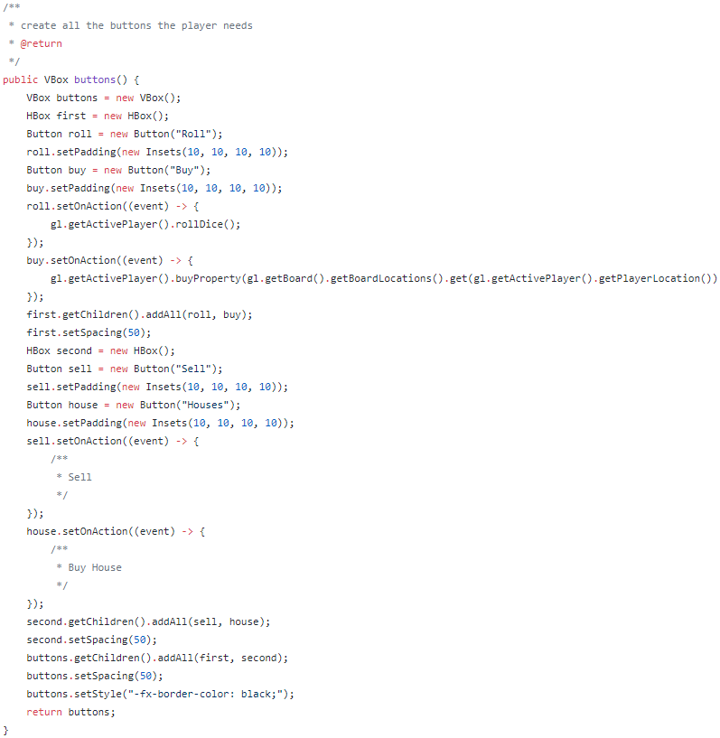
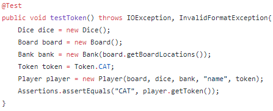
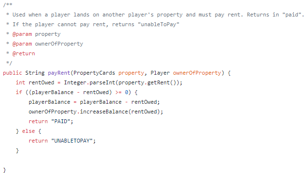

# Sprint 2 Documentation

## Summary Data

- **Team Number:** 13
- **Team Lead:** Ankeet
- **Sprint Start:** 10/02/2020
- **Sprint End:** 17/02/2020

## Individual Key Contributions

| Team Member | Key Contributions |
| :---------: | :---------------: |
|    Aiden    |  Documentation & Implementation   |
|   Ankeet    |  Organisation & Implementation   |
|    Chris    |  Implementation   |
|   Duarte    |  Implementation   |

## Task Cards

- Implement a rent feature when a player lands on an owned property
- Build a basic GUI to show the board
- Create text-based game to understand how the game should work
- Edit players to incorporate unique tokens
- Create a method to tell what actions a player can perform
- Modify objects from previous sprint with the new features

The image below shows the tasks set out on Trello during our weekly meeting

## Gantt Chart

## Requirements Analysis

### Functional Requirements

- F1
  - The software shall implement a renting mechanism in which a player will pay a small fee for landing on an owned property. For any ownable property on the board, a non-negotiable, pre-determined fee must be paid to the owner of said property immediately after landing on said property. If a property is unowned, the player shall not pay a fee to the bank.
- F2
  - The software shall be displayed in a neat and efficient manner on the screen to the players. On this graphical interface, it shall display the current player's balance. In addition, there should be buttons which will in turn either roll the dice, buy a property or sell a property.
- F3
  - The software shall indicate on the GUI what actions the current player can perform. All actions up to this point are: rolling dice, buying a property, selling a property and ending their turn. For example if the player has rolled a non-double, the software should disable the action to roll again. On the contrary if the player rolls a double, the software should keep the action to roll again available.
- F4
  - Each player in the game will have a unique identifiable token. No two players shall have the same token. This token in the future will be displayed on the board and will move around the board.

### Non-Functional Requirements
- NF1
  - To contruct the graphical user interface (GUI) of the software, our team has chosen to use JavaFX based on the premise that everyone in our team has some knowledge of JavaFX. If in the future there is an easier alternative, the question will be posed in the weekly discussion meeting to determine whether to switch.

### Domain Requirements
- D1
  - We are unsure of how the system of rolling 3 doubles and going to jail should function. We will ask the customer in our next meeting.

## Design

### UML Diagram
___

### Sequence Diagrams
___

#### Method to perform valid player actions based on their input

#### GameLoop initialiser to set the board, bank, dice and players

## Test Plan

This current sprint was a mixture of system-wide testing and classic JUnit tests. With the system-wide system, the text-based game ensured that all objects interact with every other object. In addition to this, a basic GUI was developed and testing through basic buttons and text fields.

With the **GUI**, the testing methods ensured that:
1. all visuals on the screen were correctly displayed and were visually appealing
2. all buttons that were displayed on the screen, when clicked upon, performed the attached action

With the **Player** test class, the added testing capability ensured that:
1. the correct token was chosen when a Player object was created
2. the rent functionality was correctly paid to the owner to the property. Else, the player was removed

## Summary of Sprint

In this sprint, we continued the setup and strengthening of the backend and logic of the game whilst a frontend display was constructed. With this, we added more features upon the previous sprint to get our prototype closer to the final product. The team felt a good amount of work was set out in our weekly meeting although we would have short meetings throughout the week highlighting issues and problems.

Everyone in the team continued to push out work quickly and we completed what we set out to achieve in the current iteration. This was deemed a strength. Another team member also noted that this sprint had good development of the further basic features required to make the game function properly.

In hindsight, we did not plan the system as in depth as we should have at the time. This would come back to haunt the team in the next sprint. This will be mentioned again in the next sprint.