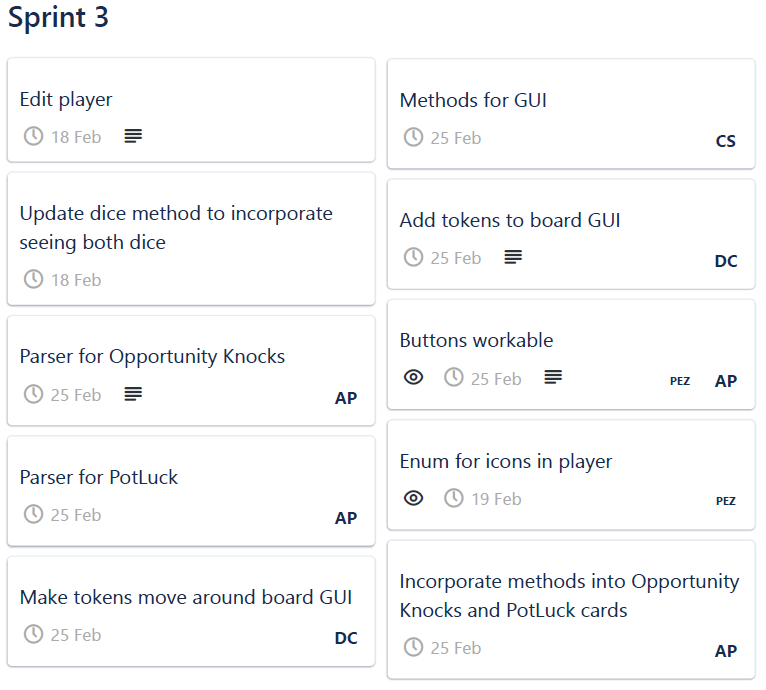
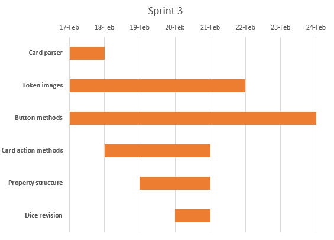
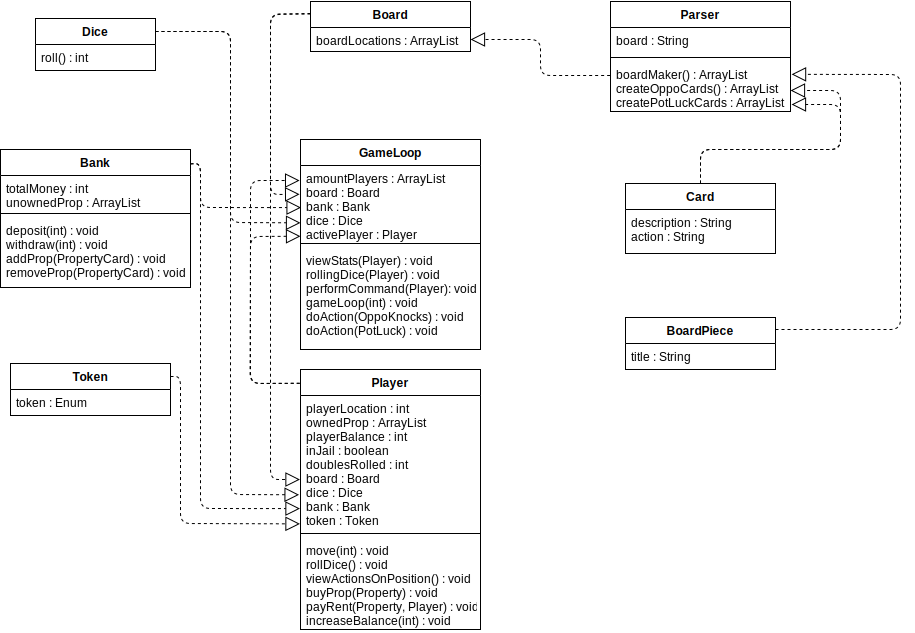
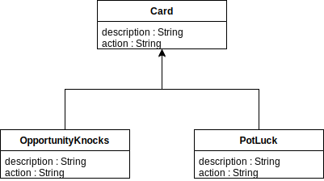
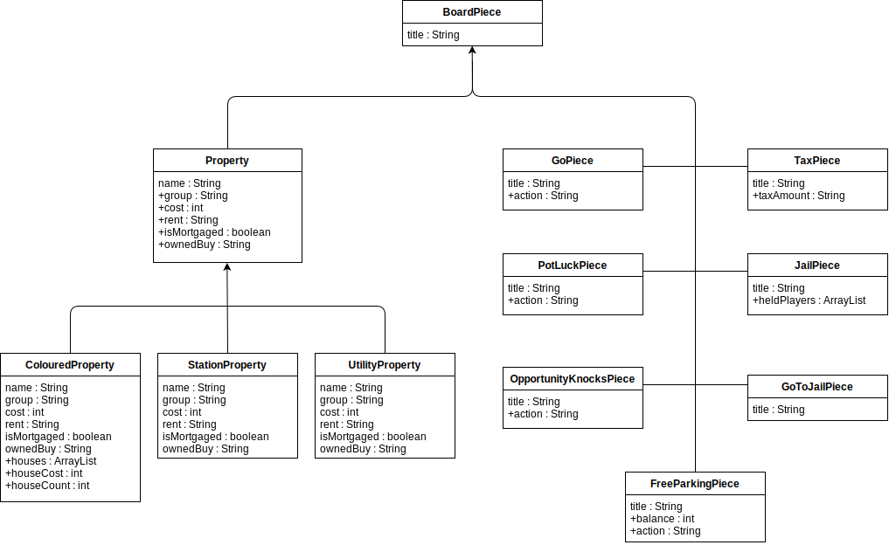
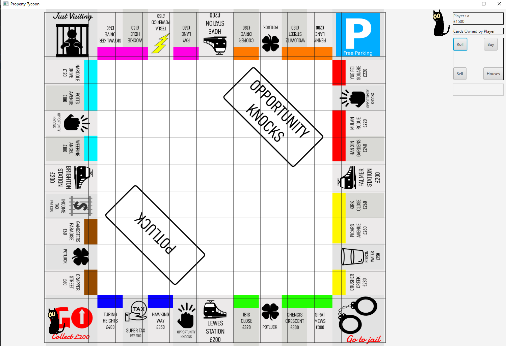
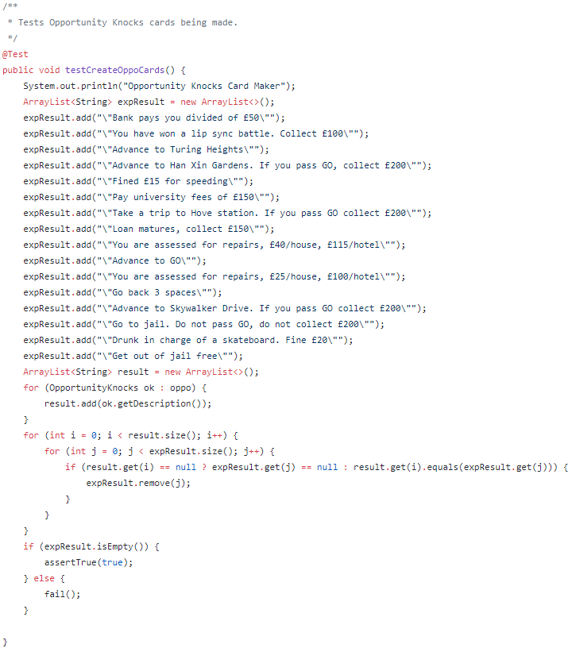
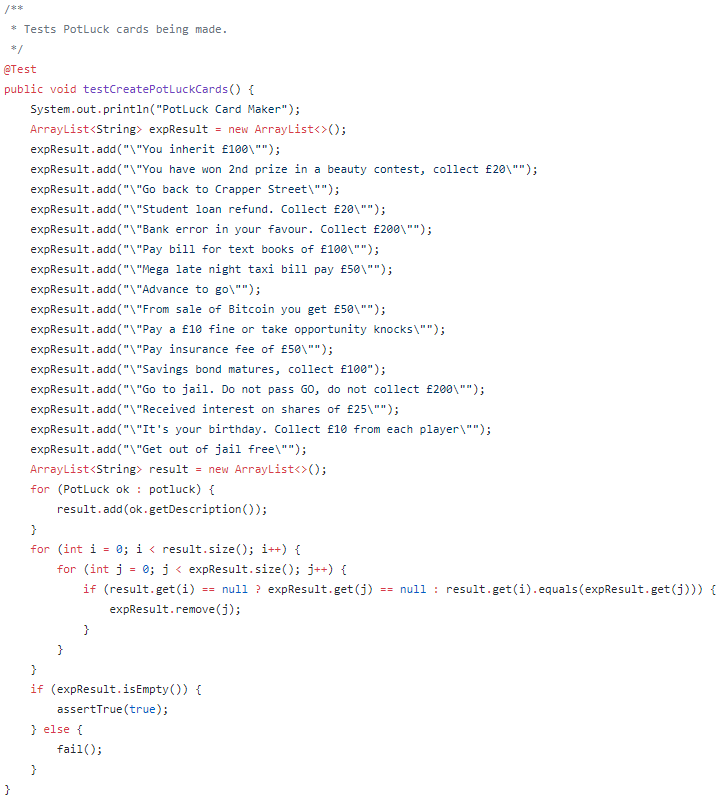

# Sprint 3 Documentation

## Summary Data

- **Team Number:** 13
- **Team Lead:** Chris
- **Sprint Start:** 17/02/2020
- **Sprint End:** 24/02/2020

## Individual Key Contributions

| Team Member | Key Contributions |
| :---------: | :---------------: |
|    Aiden    |  Documentation & Implementation   |
|   Ankeet    |  Implementation   |
|    Chris    |  Organisation & Implementation   |
|   Duarte    |  Implementation   |

## Task Cards

- Develop a parser to create Opportunity Knocks and Pot Luck cards
- Create methods to perform Opportunity Knocks and Pot Luck actions
- Revise tokens to include images of said tokens
- Revise property card structure
- Update dice to return both values instead of calling dice twice
- Develop methods to be assigned to buttons

The image below shows the tasks set out on Trello during our weekly meeting

## Gantt Chart

## Requirements Analysis

### Functional Requirements

- F1
  - The software should have an automatic parser that scans an Excel file named `PropertyTycoonCardData` and create all Opportunity Knocks and Pot Luck cards. This file contains all the information to create each Opportunity Knocks and Pot Luck card as well as grouping each card together into a list.
- F2
  - The software shall have methods to properly perform the actions of any Opportunity Knocks or Pot Luck card if landed upon by a player.
- F3
  - The software shall have hand-made images of the proposed list of tokens including a boot, a cat, a goblet, a hatstand, a phone and a spoon. These images will be created as Portable Network Graphics (PNG) files or Scalable Vector Graphics (SVG) files.
- F4
  - Rolling the dice should return 2 values for the 2 dice rolled.
- F5
  - The software shall have buttons that shall have the appropriate actions performed when pressed.

### Non-Functional Requirements
- NF1
  - The OO design of the `Card` class shall have 2 subclasses, `OpportunityKnocks` and `PotLuck`.
- NF2
  - The OO design of `BoardPiece` shall be the superclass of a variety of classes of which represent different properties with different behaviours. A diagram of the design of the new property cards are shown in the UML section.

### Domain Requirements
- D1
  - The team is unsure of how the mortgaging system will work. A question will be posed to the client in the next meeting.
- D2
  - It is unclear what happens after rolling a double. Does the player have the ability to move, possibly buy the property and roll again? The team hopes this question will be answered at a later meeting.

## Design

### UML Diagram
___

The image below shows the design of how the OpportunityKnocks and PotLuck cards were created

The image below shows the design of how the BoardPieces are structured

### Sequence Diagrams
___

#### Player picks up OpportunityKnocks/PotLuck and must put £15 in FreeParking

#### Player picks up OpportunityKnocks/PotLuck, advances to Go and received £200 

### User Interface
___

We have developed an interface that will show the board in the middle of the screen. At this moment, the board is a single image with the names of the properties hard-coded in. On top of the board images, the tokens move around from board piece to board piece.

The black grid across the board has helped us with aligning each board piece so that in a later sprint, the board piece names and types are automatically printed on start up. At the time of the image taken, we have not yet aligned this grid properly.

On the top right of the screen, we have chosen to include:
1. the player's token
2. the player's name
3. the player's owned properties
4. the buttons of which we are planning on assigning methods in the future 

## Test Plan

With respect to the Graphical User Interface on the screen, the tests created in the last sprint were used as verification.

To ensure the correct objects were being created in regards to the Opportunity Knocks and the Pot Luck cards, the 2 images below highlight the validations done in the Parser test class.

## Summary of Sprint

In this sprint, the team focused on importing the given information about Opportunity Knocks and Pot Luck cards into the game as well as implementing methods for the actions given on a card. Given these 2 new game objects, this lead a discussion on representing them as 2 objects as identical twins: everything looks similar except for their names. This previous discusstion lead to the entire property structure being redesigned. In respect to the user interface, we mainly focused on correctly displaying the tokens on the board. 

We collectively decided this current sprint was a failure based on the poor planning that ook place in sprint 2. With this, the backend system was a complete mess. A term created within our group was 'spaghetti code'. This is then on top of the classes all performing and being used for the GUI with no centralised system to manage the game. We should have spent more time talking about the execution of ideas and what parts of each idea need to go in each section. We should have communicated better in terms of what we stilled needed to do.