# Sprint 4 Documentation

## Summary Data

- **Team Number:** 13
- **Team Lead:** Ankeet
- **Sprint Start:** 24/02/2020
- **Sprint End:** 02/03/2020

## Individual Key Contributions

| Team Member | Key Contributions |
| :---------: | :---------------: |
|    Aiden    |  Documentation & Implementation   |
|   Ankeet    |  Organisation & Implementation   |
|    Chris    |  Implementation   |
|   Duarte    |  Implementation   |

## Task Cards

- Redesign and rethink the entire project
- Refactor previous classes

The image below shows the tasks set out on Trello during our weekly meeting
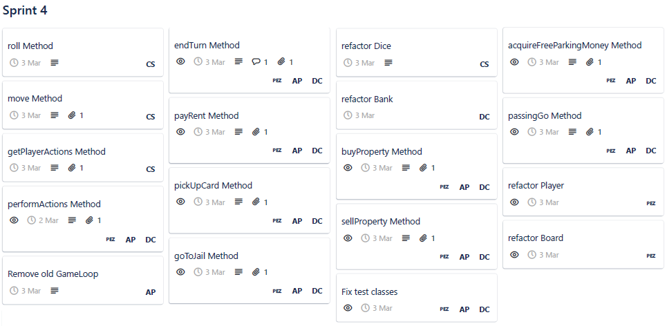

Below are some images taken from one of the brain-storming days

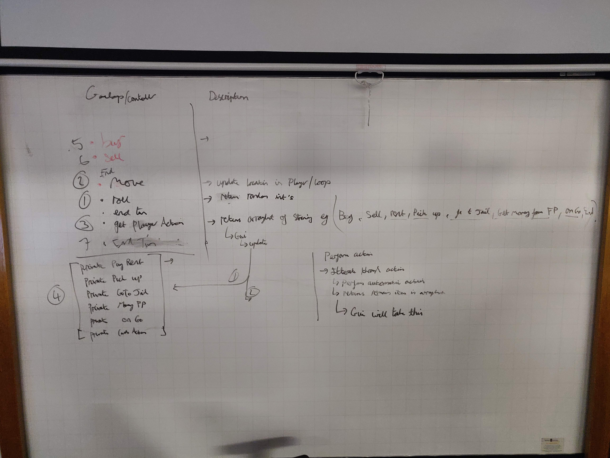

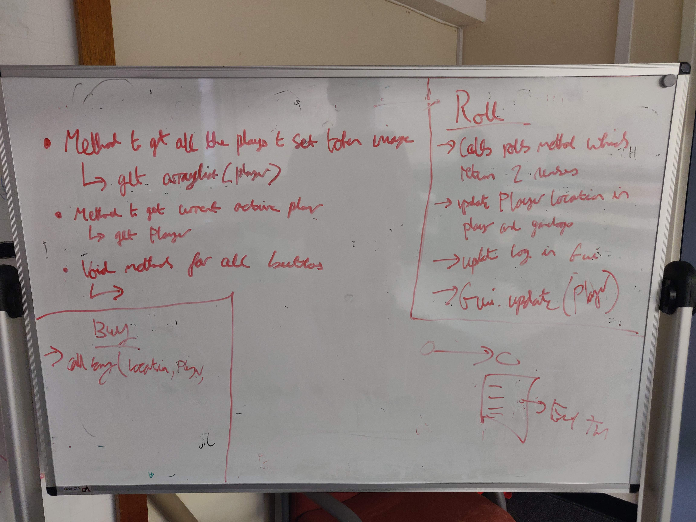

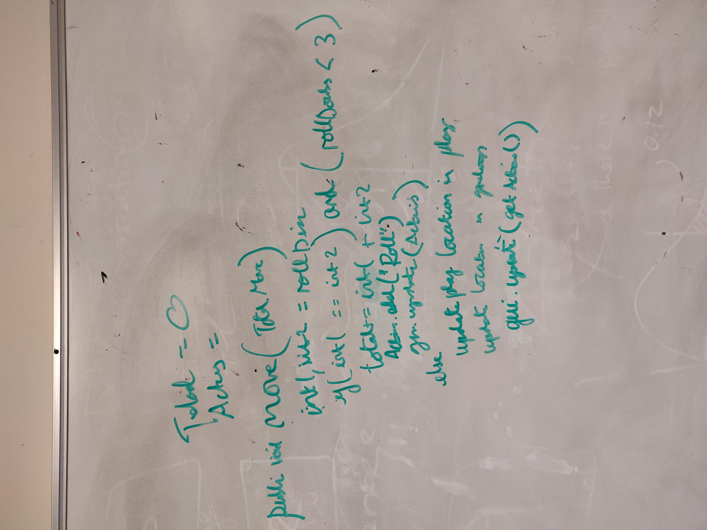

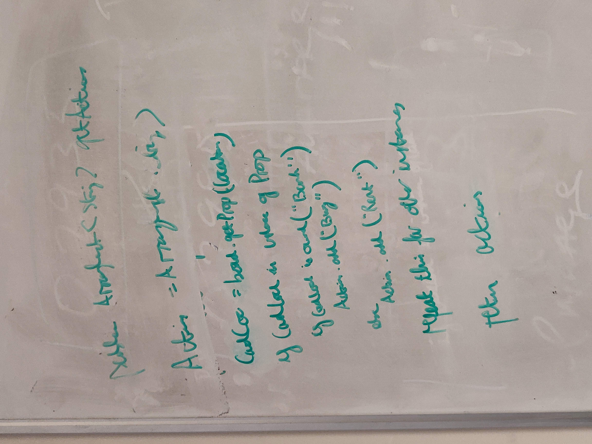

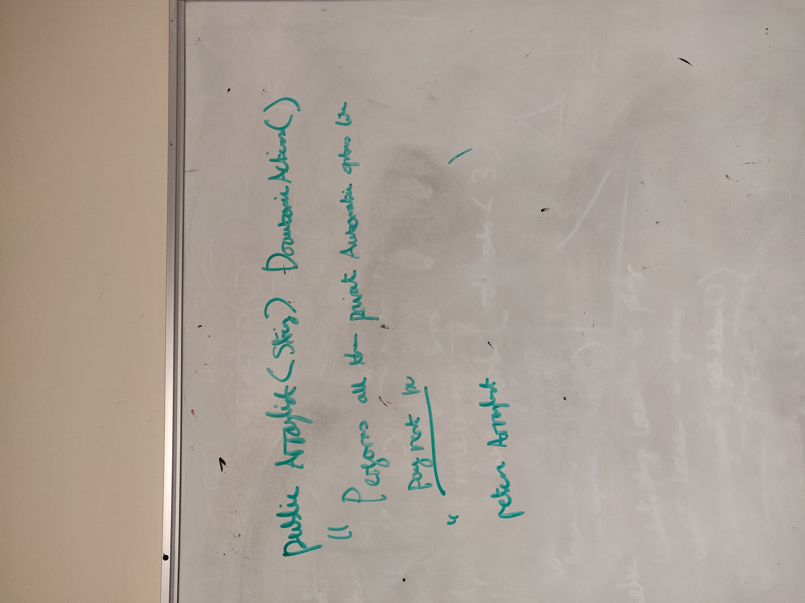

## Gantt Chart

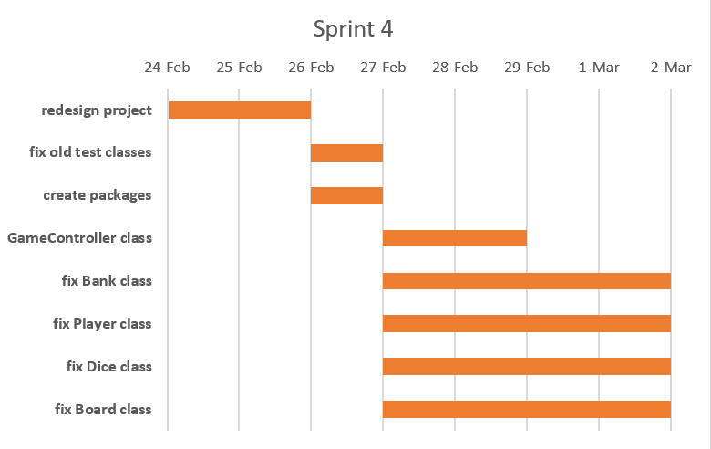

## Requirements Analysis

### Non-Functional Requirements
- NF1
  - The need for a redesign this sprint was due to the fact that our mindset was based off the textual-based game instead of developing methods to be deployed in the GUI. So after some time, we came up with a new design that should be easier to function with less spagetification (fewer calls to other classes).

## Design

### UML Diagram
___

### Sequence Diagrams
___

#### the getPlayerActions method when a player can buy a property
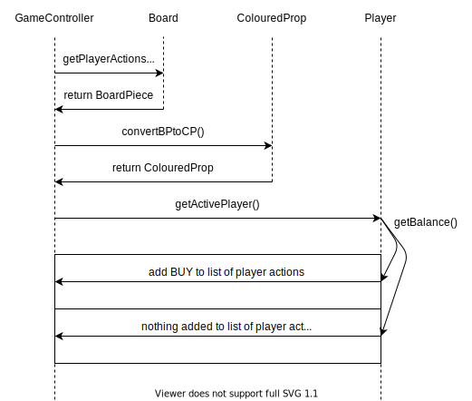

#### the goToJail method when a player lands on GoToJail piece or triple double roll

### User Interface
___

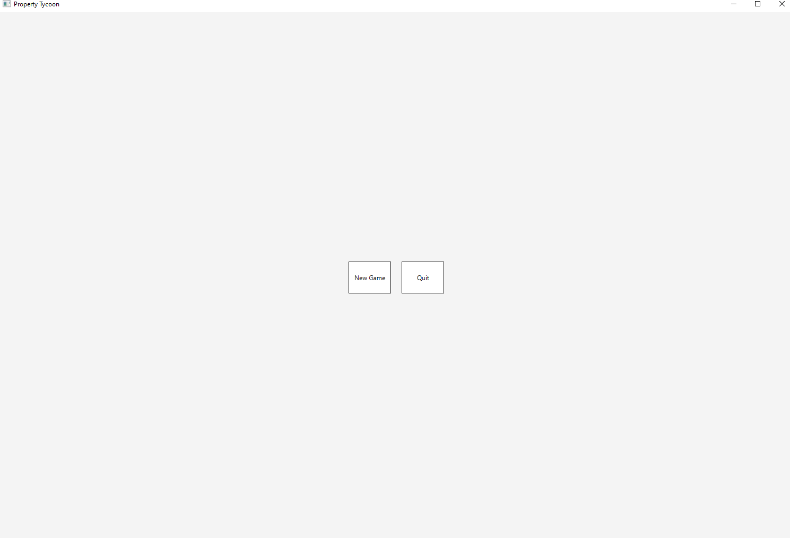

The image above shows the basic starting state of the game. There are 2 buttons to either start a game or quit the application.

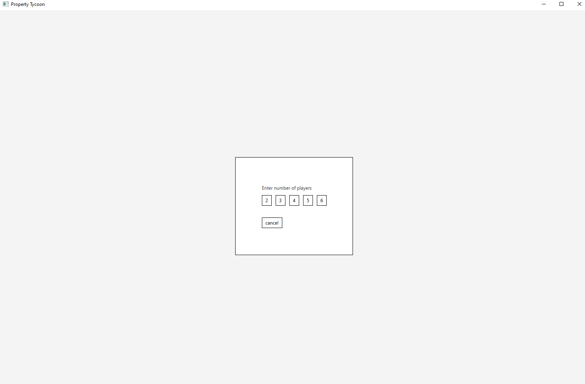

This image gathers input from a person to select how many players will be playing in the game. At the time being, only a normal game can be played. From the user requirements, the game can only be played by 2-6 players. Such is implemented.

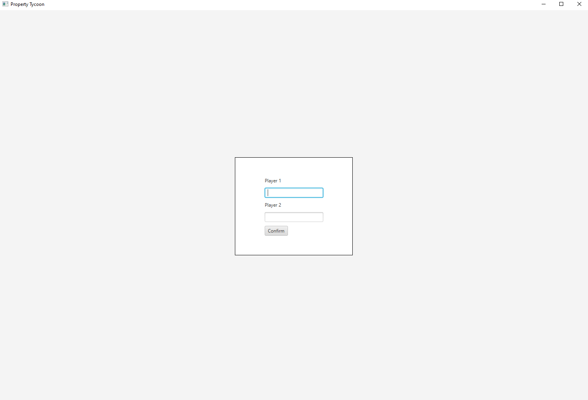

The next image shows after selecting the amount of players (in this case, 2), the players input their names into the corresponding fields and select ``confirm``.

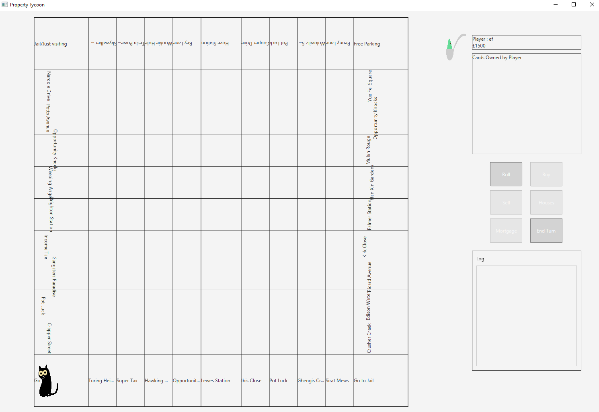

This last image shows the board as just the names of the board pieces arranged in a grid. This is our attempt at automatically creating the board and not hard-coding in the information of the board pieces. With this, 2 more buttons have been added to the group of buttons: endTurn and Mortgage. We have also made the buttons larger as well as disabling the buttons the player cannot perform automatically. Another improvement is a dedicating area for the log: a list of actions that have been performed during the game, eg. Player A has bought Turing Heights. 

## Test Plan

With the redesign, all of the logic happens in the `GameController` class. With this, a majority of the tests reside to test the functionality of the methods that could be implemented in the GUI.

In the image below, a test method of `getAction` shows the different scenarios the team is testing the class against. The result indicated what actions need to be performed by the GameController and by the player themselves.

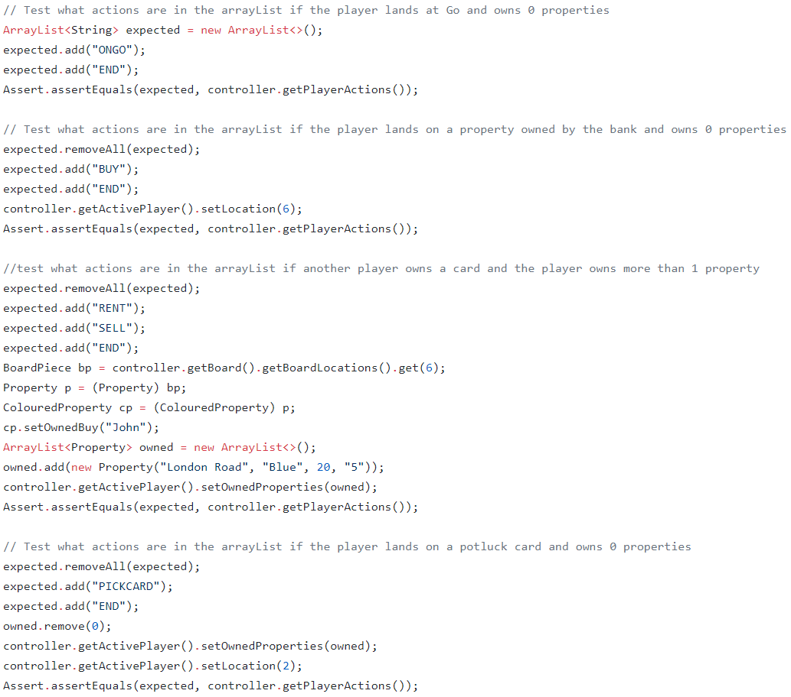

In the image below, a test method of `doActions` ensures the automatic methods are run in the GameConroller. The resulting ArrayList indicates the list of possibilities the player can take. This list also determines what buttons on the GUI can be clicked upon and enabled.

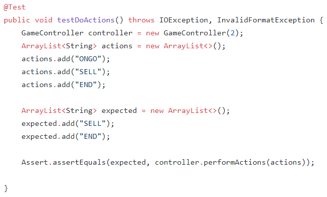

## Summary of Sprint

In this sprint, we spent a long time creating a game controller class that would be used to control the game. We worked well as a team. We held long productive discussions on the best design decisions for this system. Furthermore, the frontend visual team could begin to connect the backend logic to the frontend in a more effective way. 

In all, We completely reworked the project to the initial modules that allowed for future sprints to easily build upon. All tasks were completed without any problems. Everyone agrees that this sprint was a good recovery from the last sprint.