# Sprint 5 Documentation

## Summary Data

- **Team Number:** 13
- **Team Lead:** Chris
- **Sprint Start:** 02/03/2020
- **Sprint End:** 09/03/2020

## Individual Key Contributions

| Team Member | Key Contributions |
| :---------: | :---------------: |
|    Aiden    |  Documentation & Implementation   |
|   Ankeet    |  Implementation   |
|    Chris    |  Organisation & Implementation   |
|   Duarte    |  Implementation   |

## Task Cards

- Buy and sell houses and hotels on and off objects of `ColouredProperty`
- Mortgaging one of a player's properties
- Auctioning mechanic when a player doesn't buy a property
- Logging system to display what actions have been done
- Add a start screen to the GUI to start a game
- Get `BoardPiece` objects to print names onto board

The image below shows the tasks set out on Trello during our weekly meeting

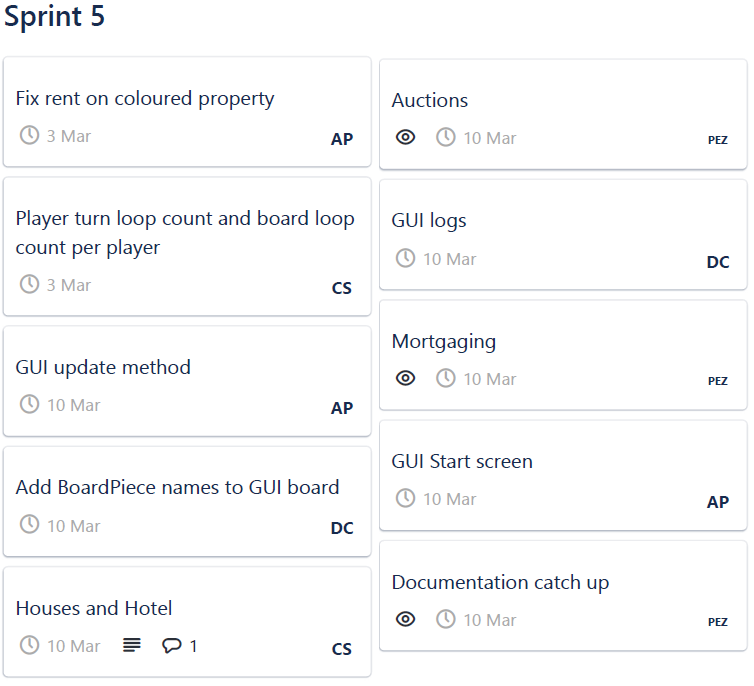

## Gantt Chart

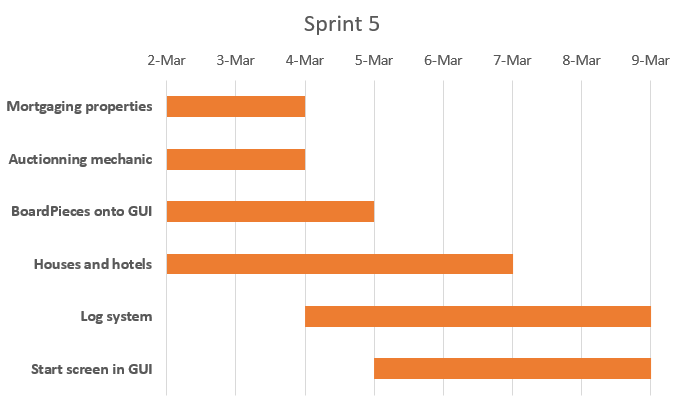

## Requirements Analysis

### Functional Requirements

- F1
  - The software shall have houses and hotels the player can improve their owned properties under certain conditions. Only coloured properties of a certain colour group can be upgraded with houses and hotels.
- F2
  - The software shall have a mechanic that players can use to mortgage one or more of their owned properties.
- F3
  - The software shall have the ability to auction a property.
- F4
  - The GUI shall display the board with the names of the `BoardPiece` objects parsed from the appropriate Excel document.
- F5
  - The GUI shall have a start screen that should display the various options of starting a game of PropertyTycoon

### Non-Functional Requirements
- NF1
  - For a player to be able to purchase a house, the player must own all properties of a certain colour group. Once this requirement is fulfilled, the number of houses on each property across each group cannot exceed a difference of 1 house. If the player passes these 2 prerequisites, the player can purchase a house on the specific property.
- NF2
  - One of the prerequisites of mortgaging a property is that the property-to-be-mortgaged must have no houses or hotels on it. If so, all houses and hotels must be sold.
  - When a player shall mortgage one of their owned properties, the player receives half of the purchasing price of the property. After this, the property is mortgaged and the player cannot collect rent on said property.
- NF3
  - To participate in an auction, a player must have travelled around the board at least once. With auction bids, they are taken in private and repeated if there are 2 or more matching maximum bids. Once a player is a winner, the property is added to their owned properties and their bid is taken out of their balance.
- NF4
  - Before creating a game, the GUI shall display the options to create a normal game, a timed game, the number of players and the number of agents.
- NF5
  - If in the case any object besides a `Property` object is called when purchasing or selling property, an exception should be created to handle such an event.

### Domain Requirements
- D1
  - When building the board in the GUI, the Excel file containing the information about the board must be present in order to play the game and buy properties

## Design

### UML Diagram
___

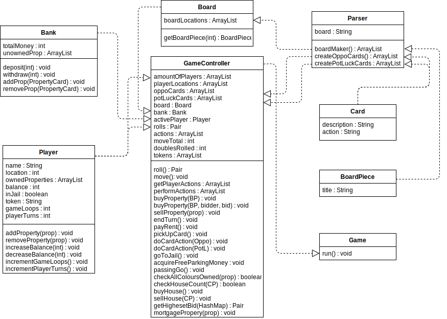

### Sequence Diagrams
___

#### When a player can successfully purchase a house on one of their owned properties

#### When a player mortgages one of their owned properties

### User Interface
___

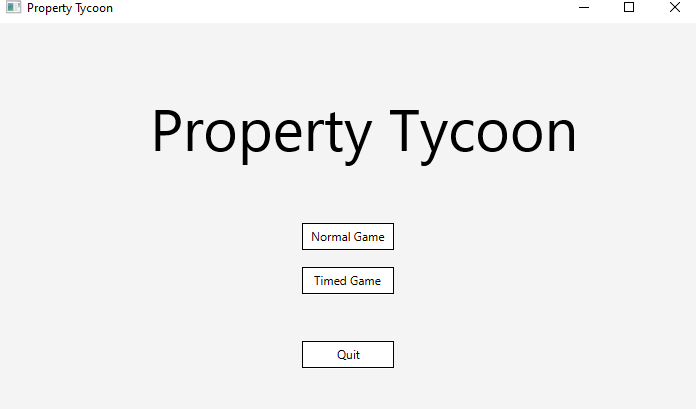

The image above shows the starting screen of the game. The title is shown across the middle of the screen as well as 3 buttons for playing a regular game, a timed game or quitting the application.

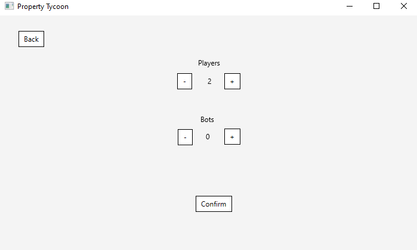

This image shows when someone has to make a decision on how many players to play with and how many agents to play against. Plus and minus buttons adjust the number in the middle.

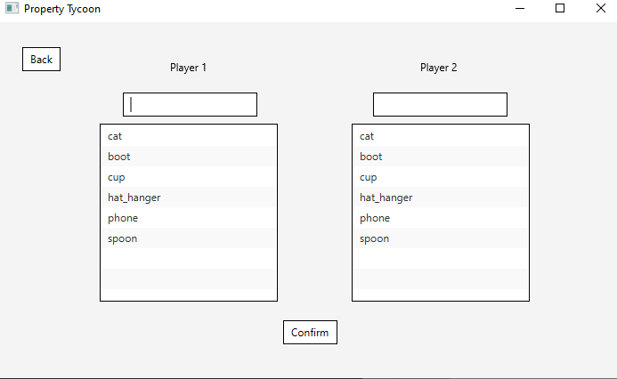

The image shows the players choosing their names and their tokens to be in the game. 2 things about choosing names and tokens is that names and tokens must be different before starting the game. If 2 or more players choose the same name or token, an error message will appear showing them that a unique name and token must be agreed upon by the players.

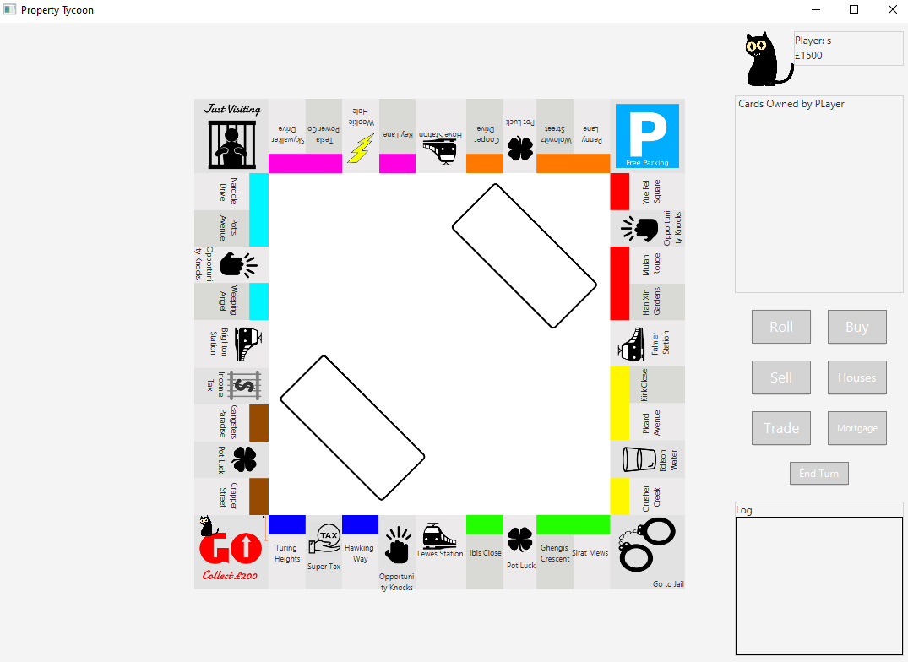

The image shows the playing board with all the board pieces together. This was created by the automatic parser that builds this board in the user interface from the information in the Excel document describing all of the board pieces. A minor addition from last sprint is the addition of a trade button. In the future, we plan on implementing a trading mechanic between players. When fully developed, 2 player can trade properties and money.

## Test Plan

With unit testing the new features within, most tests are done in the `GameController` class as it handles all of the logic.

With the `GameController` test class, it ensures that:
1. the actions the GameController and the player can possibly perform in multiple scenarios
2. the automatic actions done by the GameController are correct
3. moving around the board moves the player
4. looping around the board increments a player's gameLoop counter
5. purchasing property is added to the player's owned properties
6. buying a house on a property increases the rent of the property
7. when purchasing a house, the player owns all of its colour group and there is no larger difference of 1 house between those properties
8. selling property is removed from the player's owned properties
9. the auction gives the highest bidder the property and the bid is taken from the winner's balance
10. a player mortgaging a property adds half of the property's price to their balance

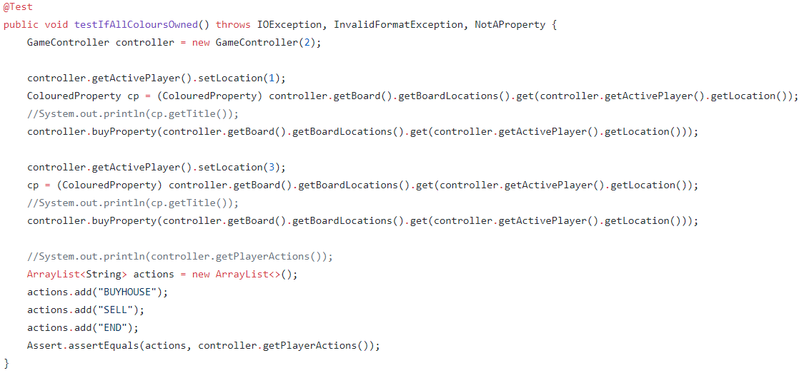

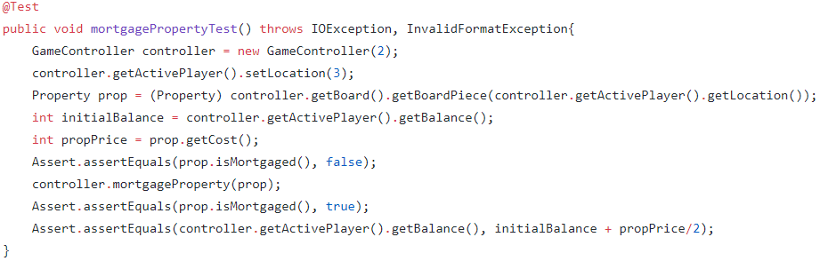

With the `Player` test class, it ensures that all accessors and mutators function properly

With the `Board` test class, it ensures that the first `BoardPiece` on the board is a `GoPiece` object

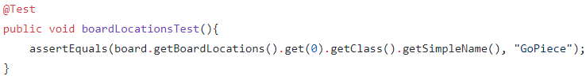

With the `Bank` test class, it ensures that:
1. withdrawing money from the bank takes away from its balance
2. depositing money to the bank adds to its balance
3. adding and removing the bank's properties function properly

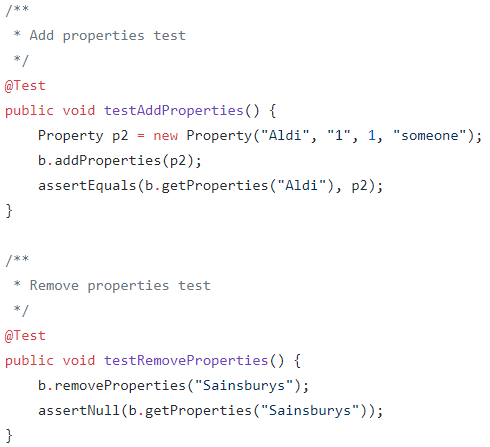

## Summary of Sprint

In this sprint, we ocntinued our split team development with 2 developers working on the backend and the other 2 developers on the frontend. This was effective and evables both sides to contue pushing working versions of the game. Some issues grow around git such as forgetting to fetch code and working on an older version of the project. 

Good development on the frontend side on integrating all the different classes that were made. There was contued development on different aspects of the game that were required. A con of this sprint would be that there was a backlog of documentation that needed to be upkept.