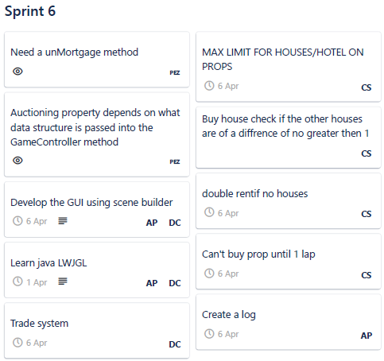
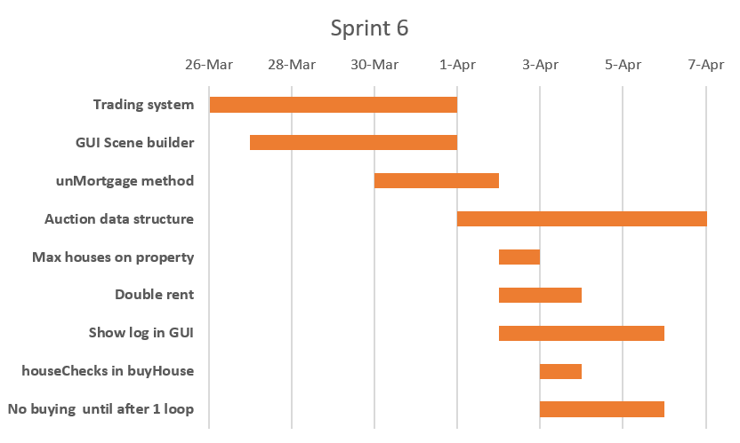
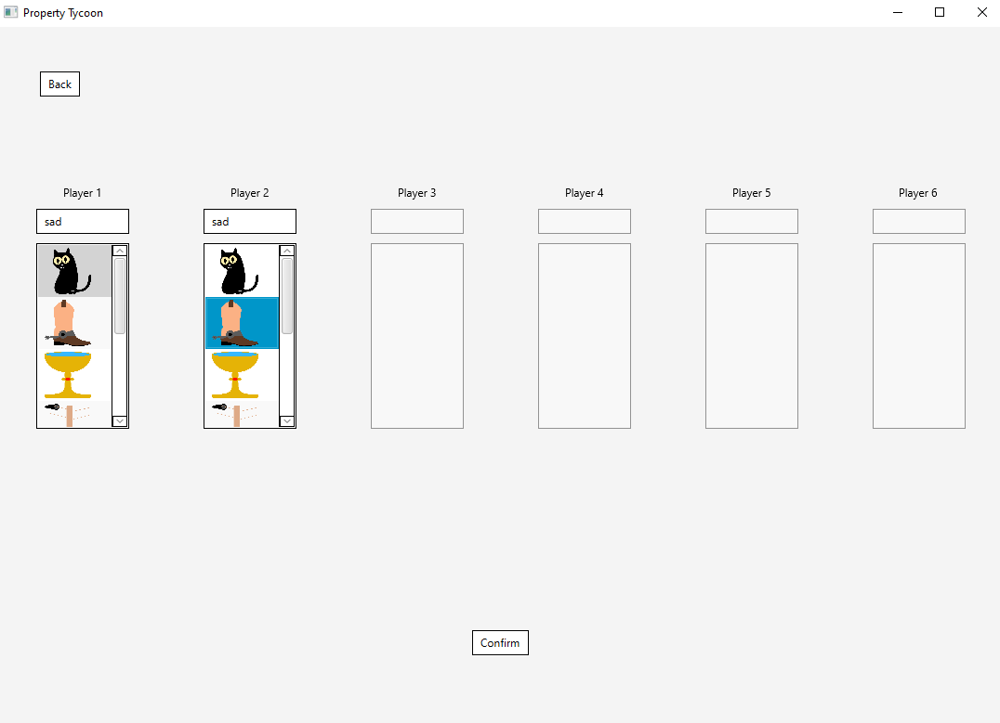
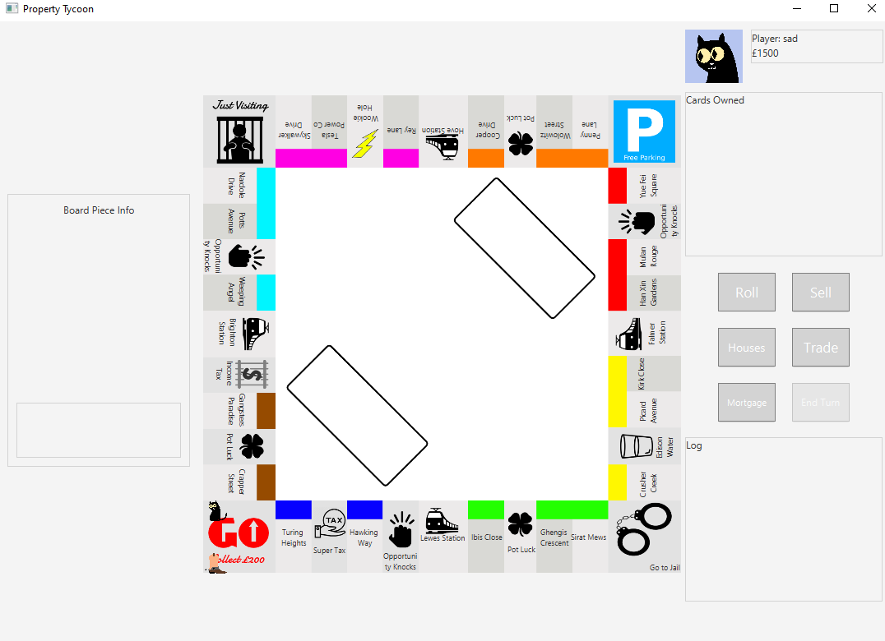
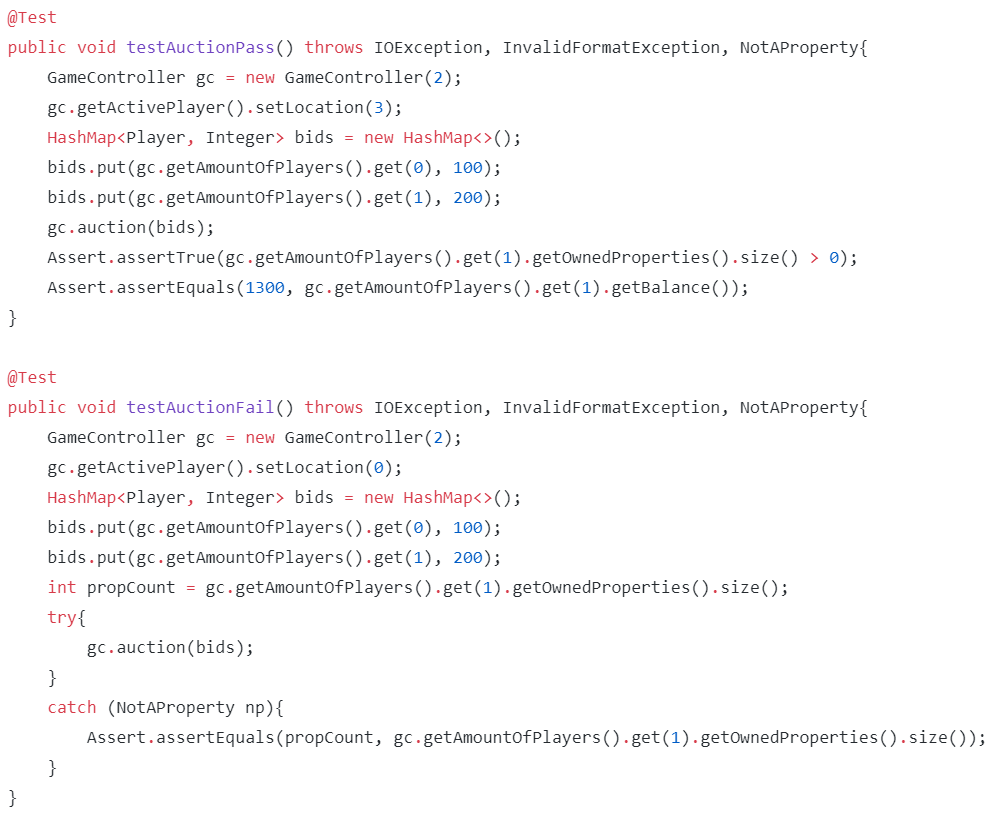
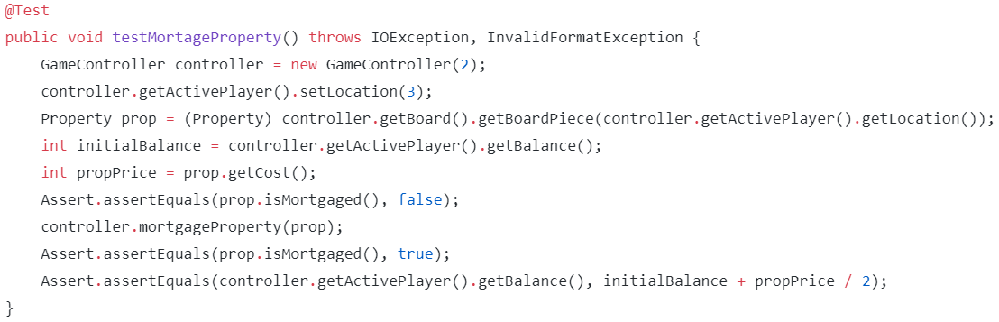
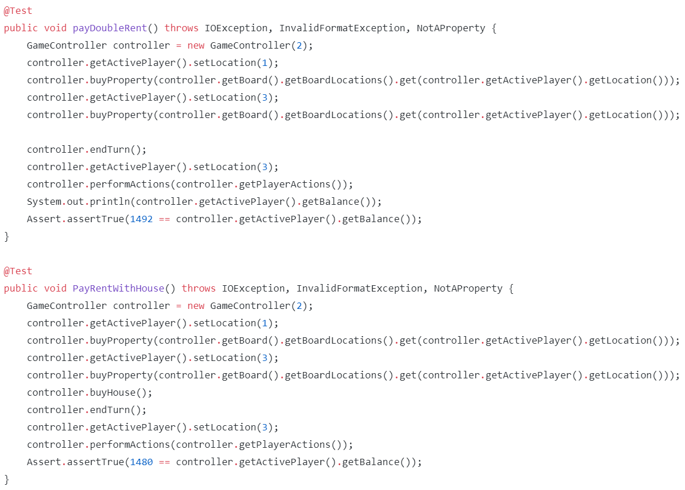

# Sprint 6 Documentation

## Summary Data

- **Team Number:** 13
- **Team Lead:** Ankeet
- **Sprint Start:** 09/03/2020
- **Sprint End:** 06/04/2020

Note: this sprint was extended to a month due to special circumstances

## Individual Key Contributions

| Team Member | Key Contributions |
| :---------: | :---------------: |
|    Aiden    |  Documentation & Implementation   |
|   Ankeet    |  Organisation & Implementation   |
|    Chris    |  Implementation   |
|   Duarte    |  Implementation   |

## Task Cards

- unMortgage method
- Decide on data structure to pass players and bids from GUI to GameController
- Develop GUI using scene builder
- Implement a trading system
- Implement the maximum number of houses on a property
- Add houseChecks into buyHouse
- Double rent if all properties of a group are owned with no houses upon them
- Property cannot be purchased until the player has looped around the board at least once
- Show the log in the GUI

The image below shows the tasks set out on Trello during our weekly meeting

## Gantt Chart

## Requirements Analysis

### Functional Requirements

- F1
  - Players shall have the ability to unmortgage a property that is currently mortgaged
- F2
  - The software shall implement a trading system between players
- F3
  - The software shall increase the rent across a colour group if a player owns all of the colour group and has no houses on them
- F4
  - Players cannot purchase any property until they have travelled at least one loop around the board
- F5
  - The software should display a log of previous events

### Non-Functional Requirements
- NF1
  - When a player is purchasing a house, the software shall check if the property can have an additional house
- NF2
  - To unmortgage a property, the player must pay half the purchasing price of the property to the bank
  - The property can then start taking rent from other players if they land on the property
- NF3
  - When a trade is created, it must be accepted by the receiver to be a successfull trade. If rejected by the receiver, the trade is dismissed.

### Domain Requirements
- D1
    - The team must ask the client what the maximum number of houses that can be bought on a single property

## Design

### UML Diagram
___

### Sequence Diagrams
___

#### Trading mechanic between 2 players

#### Ending a player's turn

### User Interface
___

An update to last sprint on choosing of names and tokens of players was that instead of words, we have added what the token would look like.

An addition to the main user interface is that the left side of the board is now a box highlighting a specific board piece on the board. This has not yet been implemented, but the appropriate space is built for it.

## Test Plan

The main updates in terms of testing is with:
1. Auctioning
2. Mortgaging
3. Rent

The next 3 images below highlight the testing capabilities of ensuring the methods function properly

## Summary of Sprint

This sprint, the frontend team tried to use a new game library to help build the unique frames for auctions and properties. This should have been discussed eaerlier in the development cycle. This new library was later dropped which we feld was a bit of a waste of time. This was the first sprint that we had to hold our sprint meetings remotely as a team member was out of the country. As a team, we coped well and stayed focused.

With the fronted, there was a complete redesign on the user interface using a new service. This has allowed the frontend team to code much easier transitions and connect different scenes together. The disadvantage of this was that the new service required more time on the user interface than should have due to a full redesign.