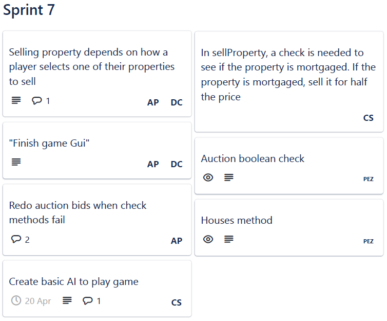
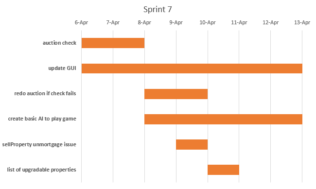
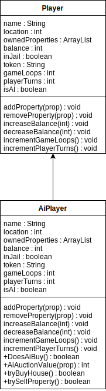
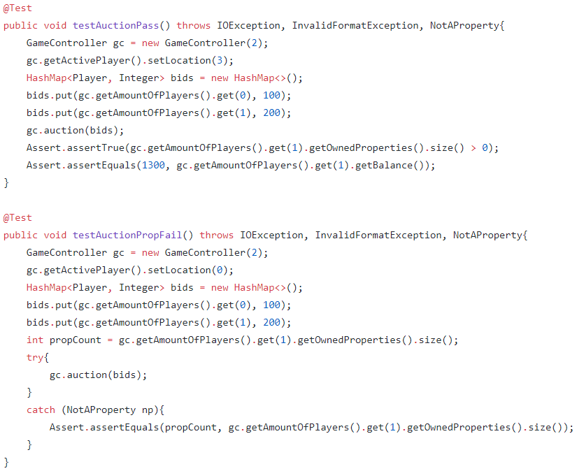
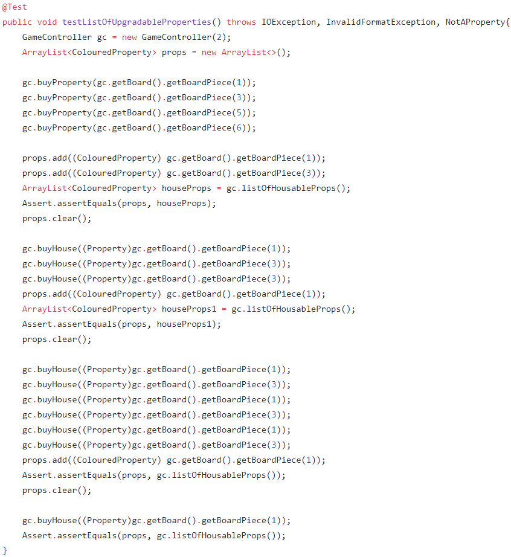

# Sprint 7 Documentation

## Summary Data

- **Team Number:** 13
- **Team Lead:** Chris
- **Sprint Start:** 06/04/2020
- **Sprint End:** 13/04/2020

## Individual Key Contributions

| Team Member | Key Contributions |
| :---------: | :---------------: |
|    Aiden    |  Documentation & Implementation   |
|   Ankeet    |  Implementation   |
|    Chris    |  Organisation & Implementation   |
|   Duarte    |  Implementation   |

## Task Cards

- Check if an auction is valid
- If property is mortgaged, sellProperty should sell it for half
- Redo auction bids if check fails in GUI
- Implement method to return what properties can be upgraded with a house
- Create basic agent to play game against player

The image below shows the tasks set out on Trello during our weekly meeting

## Gantt Chart

## Requirements Analysis

### Functional Requirements

- F1
  - Players shall have the choice of playing against artificial agents when starting a game

### Non-Functional Requirements
- NF1
  - On the start screen, players can choose how many agents to play against
- NF2
  - If a player wants to sell a mortgaged property, the software shall sell said property for half of the original price
- NF3
  - The GUI shall request from the GameController a list of properties a player could possibly upgrade or degrade with a house
- NF4
  - The auction shall check that there is only 1 maximum bid to go through with the auction. If 2 maximum bids are detected, the players in the auction shall rebid.

## Design

### UML Diagram
___

The `AiPlayer` is a subclass of `Player` with a few added methods to determine whether the agent perfroms an action or not

### Sequence Diagrams
___

#### Player unmortgages one of their properties

#### Player pays a tax

## Test Plan

In the below image in the `GameController` test class, the auction tests are set up so that:
1. when all bids are different and all conditions are met, there is a clear, defined winner
2. when one or more of the conditions fail, the property is never exchanged and no money is deducted from any balance

In the below image in the `GameController` test class, the houseImprovements method guarantees it will generate a list of properties that the player can add a house onto a coloured property

## Summary of Sprint

The sprint went well and smoothly. The sprint required the team to continue working on their set areas of development such as creating the player agents and the auction check.

We continuted to work on the game with a few debugging tasks as well. There was a good update on the user interface.