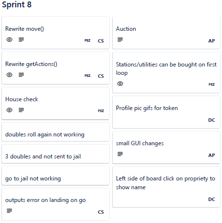
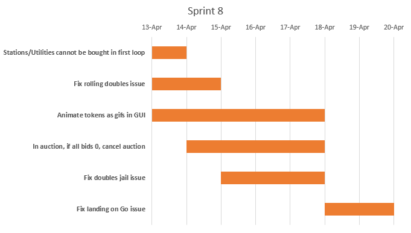
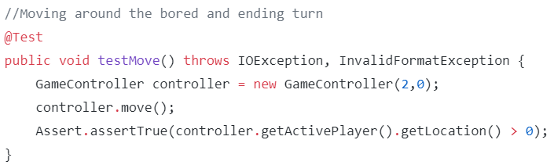

# Sprint 8 Documentation

## Summary Data

- **Team Number:** 13
- **Team Lead:** Ankeet
- **Sprint Start:** 13/04/2020
- **Sprint End:** 20/04/2020

## Individual Key Contributions

| Team Member | Key Contributions |
| :---------: | :---------------: |
|    Aiden    |  Documentation & Implementation   |
|   Ankeet    |  Organisation & Implementation   |
|    Chris    |  Implementation   |
|   Duarte    |  Implementation   |

## Task Cards

- Fix the issue of rolling doubles doesn't move the total distance
- Fix issue of rolling 3 doubles does not send the player to jail
- Fix error generated when player lands on Go after travelling around the board completely once
- Stations and utilities cannot be purchased on the first loop around the board
- Animate tokens as gifs in GUI
- If all bidder bid 0 in an auction, no player gets the property

The image below shows the tasks set out on Trello during our weekly meeting

## Gantt Chart

## Requirements Analysis

### Functional Requirements

- F1
  - The software shall not allow a player to purchase any property including `ColouredProperty`, `Station` or `Utility` until after the player have travelled around the board at least once.
- F2
  - If all bidders in an auction bid 0 on a possible property, the property shall not sold and the auction is voided.
- F3
  - Profile icons of players should be shown on the GUI as a GIF.

### Non-Functional Requirements

- NF1
  - The software shall wait to let a player buy a property until a player's gameLoops counter is incremented

## Design

### UML Diagram
___

### Sequence Diagrams
___

#### The current player has to pay rent to the owner of their current location

## Test Plan

As half of the current sprint's tasks was to fix some issues with the software, the updated code was run against previous test methods developed in the past to guarantee the functionality is proper.

As an example below, the move method ensures that the move method will produce a non-negative result greater or equal to 2 and less than or equal to 35 (counting doubles)

With this sprint, the team found the issues of the aforementioned errors, but the team did not successfully fix such errors. As a result, these tasks will be added onto the next sprint.

## Summary of Sprint

In this sprint, a majority of the time was spent debugging the software instead of completing more work towards the final product, but the sprint was successfull overall.

We had spent a week going over all the features and fixing any bugs that would not have been found by the test classes by performing system-wide testing on the user interface. We shouldn't have needed a sprint cycle to do this as it should have been done as methods were made previously.