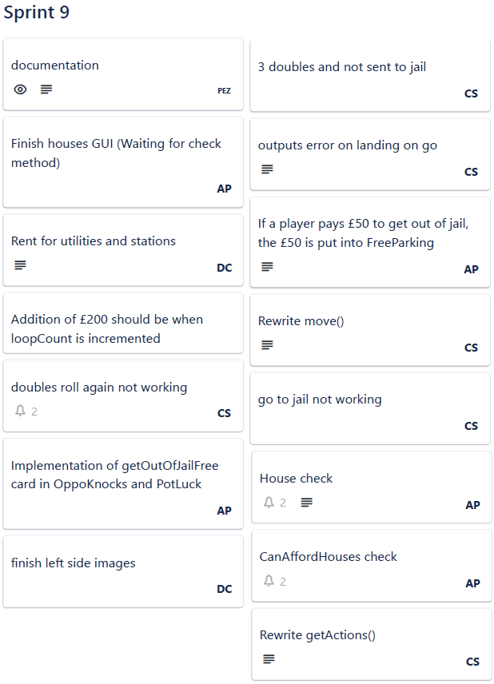
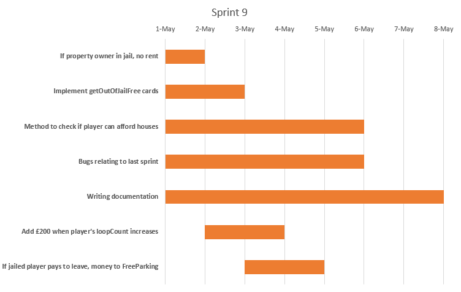
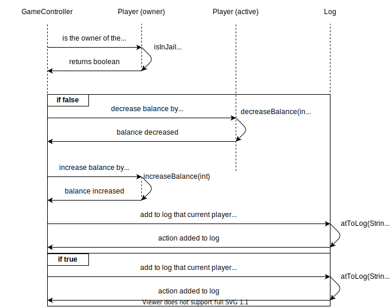

# Sprint 9 Documentation

## Summary Data

- **Team Number:** 13
- **Team Lead:** Chris
- **Sprint Start:** 01/05/2020
- **Sprint End:** 08/05/2020

## Individual Key Contributions

| Team Member | Key Contributions |
| :---------: | :---------------: |
|    Aiden    |  Documentation    |
|   Ankeet    |  Implementation   |
|    Chris    |  Organisation & Implementation   |
|   Duarte    |  Implementation   |

## Task Cards

- Addition of £200 when loopCount in Player is incremented
- Implementation of getOutOfJailFree cards in Opportunity Knocks and Pot Luck cards
- When player clicks on a BoardPiece on the board, a zoomed-in version is seen in the left-side of the screen
- Method to check if a player can afford buying houses on any of their properties
- If a property's owner is in jail, no rent shall be paid
- If jailed player pays to leave jail, money is given to FreeParking
- Bugs relating to last week's sprint

The image below shows the tasks set out on Trello during our weekly meeting

## Gantt Chart

## Requirements Analysis

### Functional Requirements

- F1
  - Players have the chance to pick up and keep a getOutOfJailFree card. Such a player can hold this card and use this card at any point in the game when the player is in jail
- F2
  - If a player decides to pay the fee to get out of jail, the money paid towards this fee goes into FreeParking
- F3
  - If a player is jailed, all of their properties forfeit the ability to collect rent. When the player get out of jail, the ability to collect rent is restored

### Non-Functional Requirements

- NF1
  - When a player either lands on Go or passes Go, their loopCounter shall be incremented. When the variable is incremented, the player shall receive the £200.
- NF2
  - When a player clicks on a BoardPiece displayed on the screen, the software should display this BoardPiece on the left-side of the screen. The title and possible colour group should be displayed as well.

### Domain Requirements

- D1
  - Our team is currently looking into the ability to compress our project into a single JAR file. If there is sufficient evidence that this will make the creating a game easier, it should be present in the submission.

## Design

### UML Diagram
___

### Sequence Diagrams
___

#### new move method to incorporate rolling doubles error

#### payRent method when the owner of the property doesn't own all of that group

## Test Plan

Unlike the previous sprints in this project, much of the testing was done on the front-end to ensure the buttons function as they are supposed to, text fields get updated with GameController actions and appropriate windows open eg. auction.

## Summary of Sprint

The main focus of this sprint was the continued debugging of the project and performing system-wide testing. On the frontend, the user interface was developed to incorporate the buying and selling of houses on player-owned properties. In the backend, there was a clean-up of the code base for creating a fully functioning version of the game.